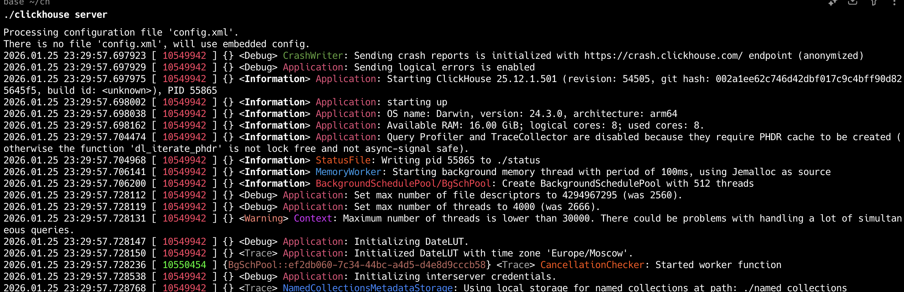
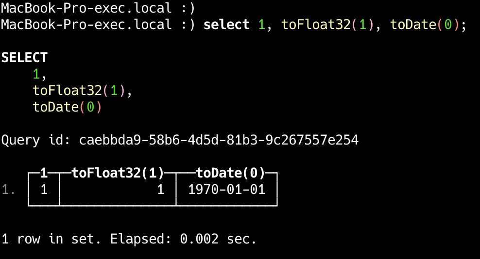
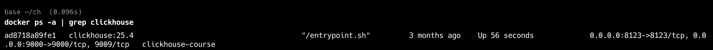
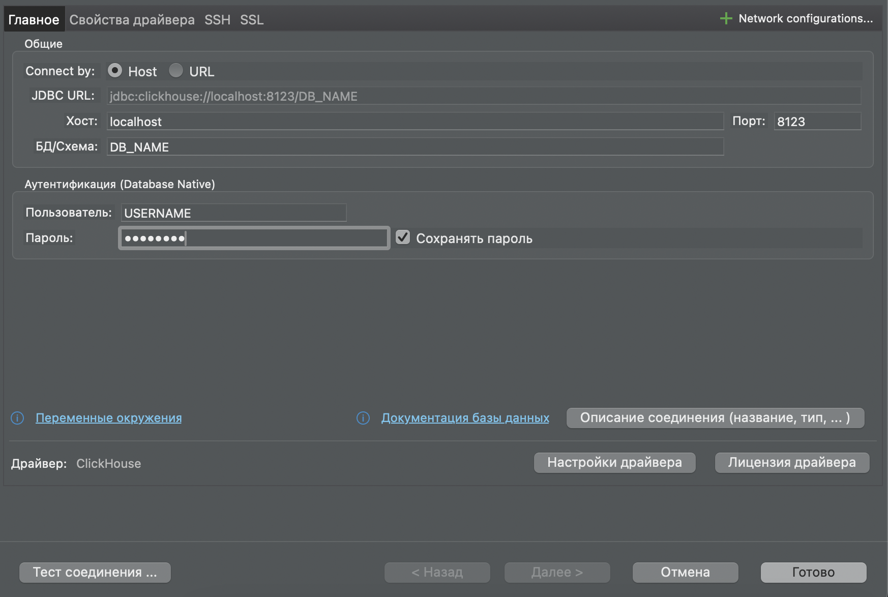
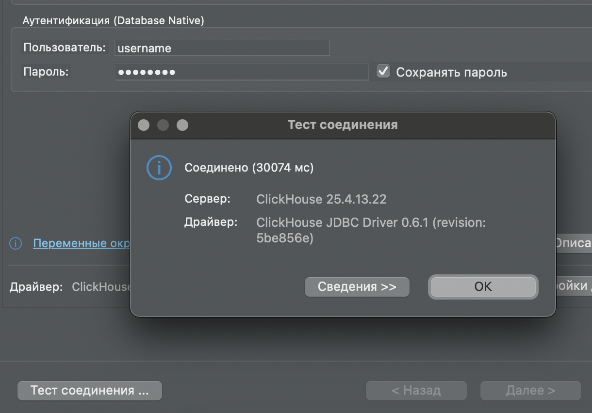
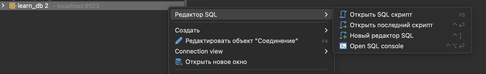
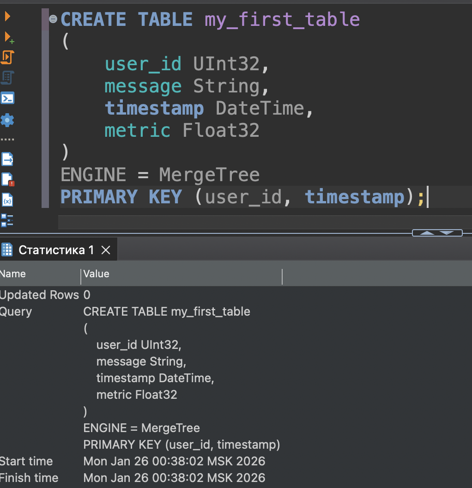

## Easy install

### For mac, linux, WSL on WIN
### 1 - Download clickhouse
```bash
curl https://clickhouse.com/ | sh
```

### 2 - Start server
```bash
./clickhouse server
```
You should see lots of logs


### 3 - Start client in another terminal
If have to see
```bash
\<hostname\> :)
```
So, have fun


### 4 - Try WebUI
Visit http://localhost:8123
Web SQL UI is available on http://localhost:8123/play

--------

## Docker insallation

### 1 - Run container
```bash
docker run 
    --name clickhouse 
    -e CLICKHOUSE_DB=<DB_NAME>
    -e CLICKHOUSE_USER=<USERNAME> 
    -e CLICKHOUSE_DEFAULT_ACCESS_MANAGEMENT=1 
    -e CLICKHOUSE_PASSWORD=<PASSWORD> 
    -p 8123:8123 
    -p 9000:9000
    -d 
    -v clickhouse-logs:/var/log/clickhouse-server 
    -v clickhouse-data:/var/lib/clickhouse 
clickhouse:25.4
```
Check if container started
```bash
docker ps -a | grep clickhouse
```


### Connect with DBeaver
#### New connection -> Clickhouse




Connection test


Open SQL script


Have fun
